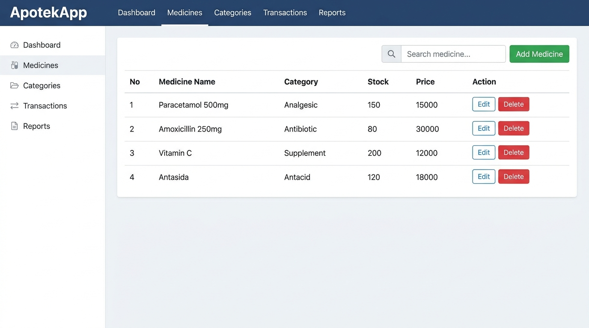

# ApotekApp — Pharmacy Management System

> An MVC-based web application for managing pharmacy inventory, medicine categories, and cashier transactions.

[]()
[]()
[]()
[](LICENSE)

---

## About The Project

ApotekApp is a comprehensive pharmacy management system built with CodeIgniter 4 following the MVC architecture. It helps pharmacy owners digitize their medicine inventory, track sales transactions, and manage product categories efficiently.

---

## Screenshots

**Medicine Inventory**


---

## Features

- **Medicine Inventory** — Add, edit, delete, and view all medicines with stock levels
- **Category Management** — Organize medicines by category with filtering
- **Cashier & Transaction Module** — Record sales transactions with automatic stock deduction
- **Transaction History** — View and filter past sales records
- **User Authentication** — Secure login system
- **Search & Filter** — Quickly find medicines by name or category
- **Responsive UI** — Clean interface built with Tailwind CSS

---

## Tech Stack

| Layer | Technology |
|:---|:---|
| Backend | CodeIgniter 4 (PHP 8) |
| Frontend | CI Views + Alpine.js |
| Styling | Tailwind CSS |
| Database | MySQL |
| Dev Tools | Composer, NPM |

---

## Folder Structure

```
apotekapp/
├── app/
│   ├── Controllers/        # MVC Controllers (Medicine, Category, Transaction)
│   ├── Models/             # Database models with query builder
│   ├── Views/              # PHP view templates
│   │   ├── medicines/      # Medicine CRUD views
│   │   ├── categories/     # Category management views
│   │   └── transactions/   # Cashier & history views
│   └── Config/             # App configuration files
├── database/
│   ├── migrations/         # DB schema migrations
│   └── seeds/              # Database seeders
├── public/                 # Entry point & static assets (CSS, JS, images)
├── writable/               # Cache, logs, uploads
└── screenshots/            # Project screenshots
```

---

## Getting Started

### Prerequisites

- PHP 8.1+
- Composer
- Node.js 16+
- MySQL 8.0+

### Installation

**1. Clone the repository**
```bash
git clone https://github.com/Abdul-anip/apotekapp.git
cd apotekapp
```

**2. Install PHP dependencies**
```bash
composer install
```

**3. Environment setup**
```bash
cp env .env
```

**4. Configure database** in `.env`:
```env
database.default.hostname = localhost
database.default.database = apotek_db
database.default.username = root
database.default.password = your_password
database.default.DBDriver = MySQLi
```

**5. Run database migration**
```bash
php spark migrate
php spark db:seed DatabaseSeeder
```

**6. Start the development server**
```bash
php spark serve
```

**7. Access the app**

Open [http://localhost:8080](http://localhost:8080) in your browser.

---

## License

Distributed under the MIT License. See [LICENSE](LICENSE) for more information.

---

## Author

**Abdul Hanif** — D4 Software Engineering Technology, Politeknik Negeri Padang

[](https://abdul-anip.github.io/CV/)
[](https://linkedin.com/in/abdul-hanif-78649b331)
